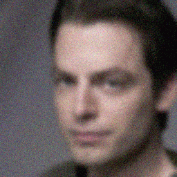
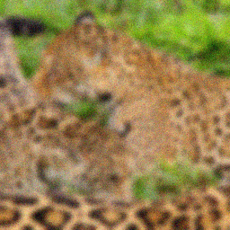
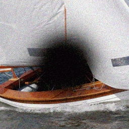

# DiracDiffusion: Denoising and Incremental Reconstruction with Assured Data-Consistency (ICML 2024)

This is the official repository for the paper *DiracDiffusion: Denoising and Incremental Reconstruction with Assured Data-Consistency*.

> [**DiracDiffusion: Denoising and Incremental Reconstruction with Assured Data-Consistency**](https://openreview.net/pdf?id=ibwxzYCep9),  
> Zalan Fabian, Berk Tınaz, Mahdi Soltanolkotabi  
> *ICML 2024*  


We introduce a novel framework for solving inverse problems using a generalized notion of diffusion that mimics the corruption process of a particular image degradation. Our method maintains data consistency throughout the reverse
diffusion process allowing us to early-stop during reconstruction and felxibly trade off perceptual quality for lower distortion.

|  |  |  |  |
|:-----------------------------------:|:-----------------------------------:|:-----------------------------------:|:-----------------------------------:|


## Requirements

CUDA-enabled GPU is necessary to run the code. We tested this code using:
- A6000 GPUs
- Ubuntu 20.04
- CUDA 12.2
- Python 3.10

## Setup
1. In a clean virtual environment run
```bash
git clone https://github.com/z-fabian/dirac-diffusion
cd dirac-diffusion
pip install -r requirements.txt
```
2. Configure the root folder for each dataset in the [dataset config file](configs/data/dataset_config.yaml).
3. (Optional) Download pre-trained checkpoints into the `checkpoints` directory within the repository.

## Data
We evaluate *Dirac* on CelebA-HQ (256x256), FFHQ (256x256) and ImageNet. Our code expects the datasets in the following library structure:
- CelebA-HQ: the root folder contains all files directly, numbered `00000.jpg` - `30000.jpg`.
- FFHQ: the root folder contains subfolders `00000` - `00069` each with 1000 images. 
- ImageNet: the root folder contains `train` and `val` folders.

## Pre-trained models
| Train dataset      | Operator   | Training loss  | Checkpoint size | Link |
| ------------ | ---------- | -------------- | --------------- | ---- |
| CelebA-HQ | Gaussian blur | $\mathcal{L}_{IR}(\Delta t=0.0; \theta)$     | 776M           | [Download](https://drive.google.com/file/d/1dWAr4tsfmOcKOH3MfRH0oRx9nrxbr5ld/view?usp=sharing) |
| CelebA-HQ | Gaussian blur | $\mathcal{L}_{IR}(\Delta t=1.0; \theta)$       | 776M            | [Download](https://drive.google.com/file/d/14byEkxJrJF-R96ujvzCElKxLruw-zRTk/view?usp=sharing) |
| CelebA-HQ | Inpainting   | $\mathcal{L}_{IR}(\Delta t=0.0; \theta)$         | 776M            | [Download](https://drive.google.com/file/d/1ZDrI8_2H7KCTvBCpteNnLHuSUq9ZEfH-/view?usp=sharing) |
| ImageNet | Gaussian blur   | $\mathcal{L}_{IR}(\Delta t=1.0; \theta)$         | 776M           | [Download](https://drive.google.com/file/d/1kxyHdV_cddg8TeuwOjS89KOW_SWVEgAZ/view?usp=sharing) |
| ImageNet| Inpainting | $\mathcal{L}_{IR}(\Delta t=0.0; \theta)$     | 5.8G            | [Download](https://drive.google.com/file/d/1vxfq7K9By_gVx9grcO3AFVb5D0IdGhCY/view?usp=sharing) |

## Model training
To train an incremental reconstruction model from scratch, run
```bash
python scripts/train_dirac.py fit --config PATH_TO_CONFIG
```
and replace `PATH_TO_CONFIG` with the trainer config file. See trainer configs [here](configs/trainer) for deblurring and inpainting experiments. In case your GPU doesn't support mixed-precision training, change `precision` to `fp32` in the config file.

## Reconstruction
To reconstruct images, run
```bash
python scripts/recon_dirac.py --config_path PATH_TO_CONFIG --dataset DATASET_NAME
```
and replace `PATH_TO_CONFIG` with the reconstruction config file and `DATASET_NAME` with the name of the dataset to be reconstructed (either 'celeba256', 'ffhq' or 'imagenet'). You can find config files for both perception-optimized and distortion-optimized reconstructions [here](configs/reconstruction).

## Citation

If you find our paper useful, please cite

```bibtex
@inproceedings{fabian2023diracdiffusion,
  title={Diracdiffusion: Denoising and incremental reconstruction with assured data-consistency},
  author={Fabian, Zalan and Tinaz, Berk and Soltanolkotabi, Mahdi},
  booktitle={Forty-first International Conference on Machine Learning},
  year={2023}
}
```

## Acknowledgments
This repository builds upon code from
- [Elucidating the Design Space of Diffusion-Based Generative Models (EDM)](https://github.com/NVlabs/edm) for models
- [Diffusion Posterior Sampling for General Noisy Inverse Problems](https://github.com/DPS2022/diffusion-posterior-sampling) for some operators
- [NVIDIA NeMo Framework](https://github.com/NVIDIA/NeMo/tree/main) for EMA implementation